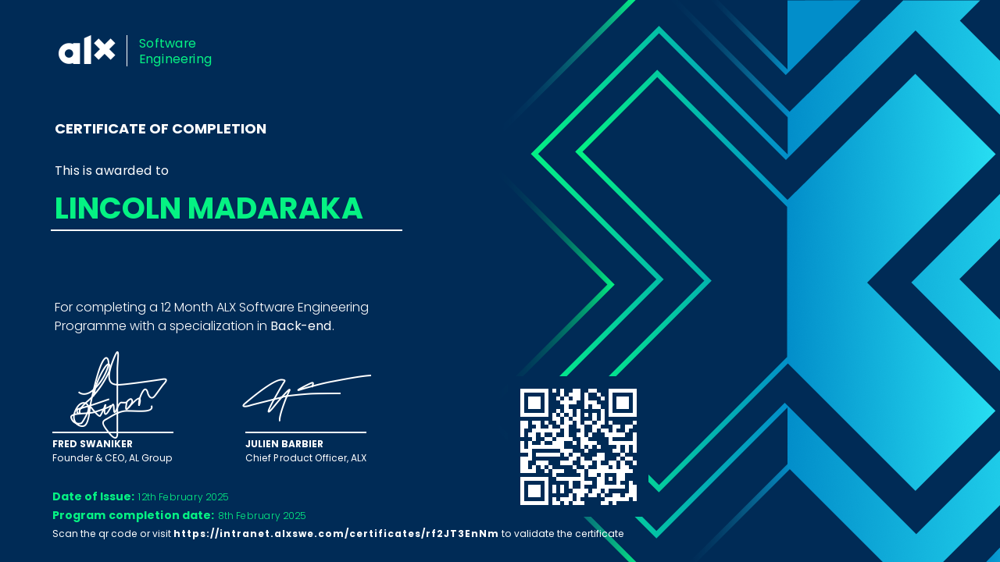
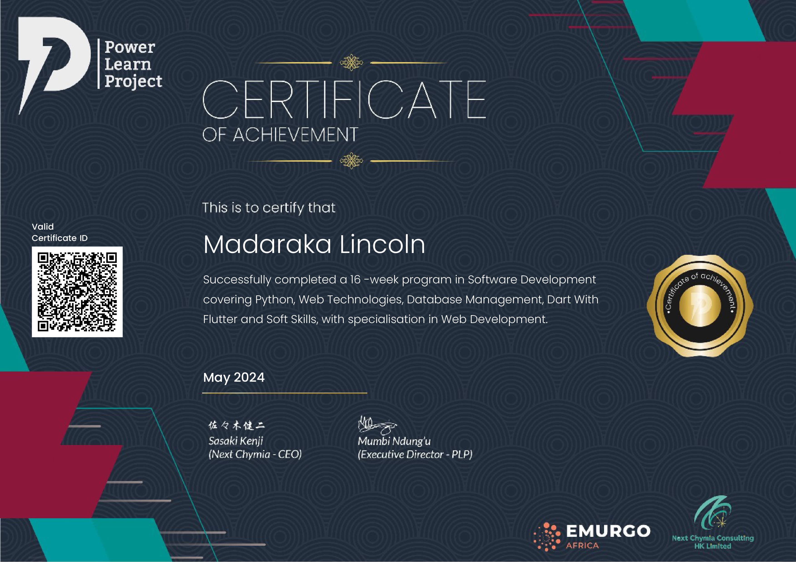
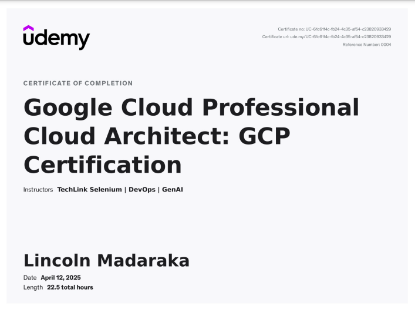
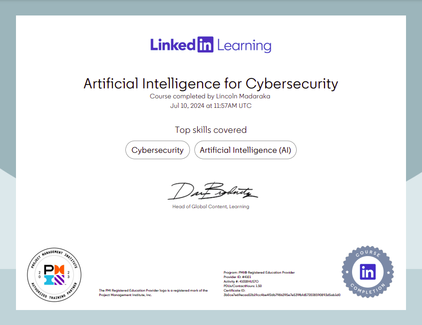
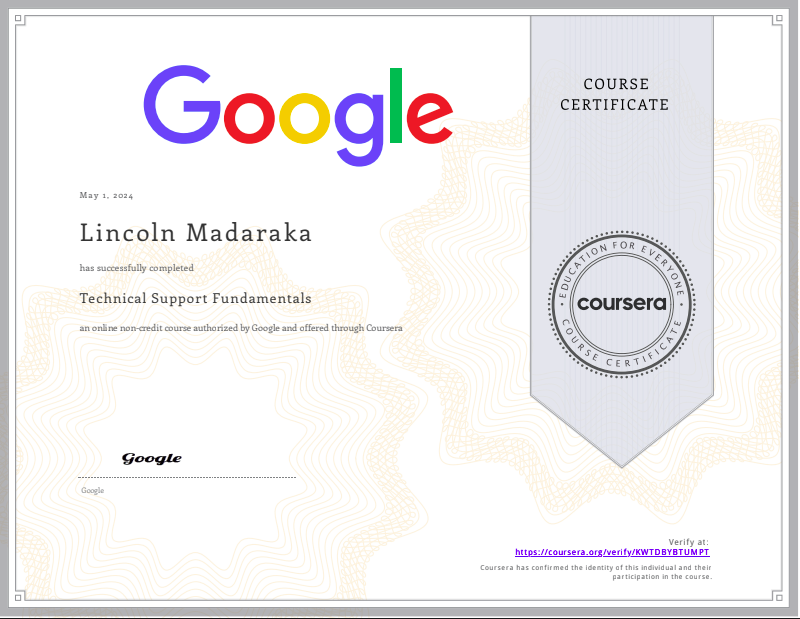

Lincoln Madaraka – Software Engineer, Full-Stack & DevOps Specialist

## About Me
I’m Lincoln Madaraka, a Kenyan software engineer specializing in backend development, full-stack applications, and DevOps engineering.
I have a Degree from Kenyatta University and a Software Engineering Certification from Holberton School's Africa Leadership Experience(ALX) SWE, I build scalable, secure and cloud-ready systems.

I focus on:
1. Fullstack Mobile and Web App development.
2. Infrastructure automation & CI/CD pipelines.
3. Cloud platforms like AWS, GCP and Azure.
4. System security and high availability.
5. Backend API development.

## Skills & Tech Stack

1. Programming Languages: *Python, PHP, JavaScript, Bash*
2. Frameworks: *Django, Node.js, React (basic), Next.js*
3. DevOps Tools: *Docker, GitHub Actions, CI/CD pipelines, systemd*
4. Cloud & Infrastructure: *Google Cloud, AWS (basic), Nginx, Linux server management*
5. Databases: *MySQL, SQLite, MongoDB*
6. Other Tools: *Git, Postman, Jupyter, Linux CLI, Figma, VS Code, Jira.*

## Career Goals
My career mission is to be recognized among the best software engineers in Kenya and globally — building, automating and optimizing software systems that matter.
I aim to contribute as a Full-Stack & DevOps Engineer by:

- Automating infrastructure & deployment pipelines
- Creating reliable backend APIs and user-friendly full-stack applications
- Leveraging cloud services for performance & cost-efficiency
- Maintaining secure, highly-available systems

## Featured Projects by Lincoln Madaraka
1. [Portfolio Website](https://lincoln-madaraka-portfolio.vercel.app/)
Personal website showcasing my work, certifications, and skills.
Tech: HTML, CSS, JavaScript | Hosted on Vercel

2. [StaffFile](https://payroll-manager.onrender.com/) 
Payroll management application built with Laravel and SQL for managing employee salaries. | Live On Render

3. [MwangazaFarm 254](https://mwangazafarm254.vercel.app/)
An AI-powered produce marketplace connecting Kenyan farmers to urban buyers.
Built with React to empower agriculture through technology. | On Vercel

4. [Cytask](https://cytask-system.onrender.com/)
A PHP-based task management application with authentication, categorization, and status tracking.
(updating on hosting issue soon)

5. [Health Information System](https://health-information-syst.onrender.com/login)
A Django app for managing medical records with secure authentication and CRUD features.

### Certifications & Training
## 1. ALX Software Engineering –  A Certified Software Engineer, Backend Pro

## 2. Power Learn Project – Efficient Certified Web Developer.

## 3. Google Cloud Platform – Professional Cloud Architect (badge issued)

## 4. Git Essentials – LinkedIn Learning

## 5. Google IT Support Certificate – Coursera

## Education
## Bachelors Degree – Kenyatta University (2021–2025)
Key modules: *Systems Administration, Networking, Backend Web Development, Embedded Systems and Internet of Things*

Software Engineering - Holberton School

## Let’s Connect
📧 Email: madarakalincoln48@gmail.com
🐦 [MyTwitter](https://twitter.com/syntaxrtx)
🌍 [MyPortfolio](https://lincoln-madaraka-portfolio.vercel.app/)

⭐️ Feel free to check out my repositories, explore my code, and connect with me.  
Let’s build the future of software together. Modifying soon

