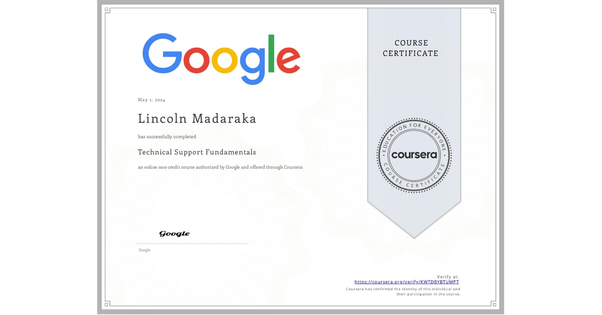

Lincoln Madaraka – Software Engineer, Full-Stack & DevOps Specialist

## About Me
I’m Lincoln Madaraka, a Kenyan software engineer specializing in backend development, full-stack applications, and DevOps engineering.
I have BSc. in Telecommunication & Information Technology Degree from Kenyatta University and a Software Engineering Certification from Africa Leadership Experience(ALX) SWE, I build scalable, secure and cloud-ready systems.

I focus on:
1. Backend API development and Fullstack Mobile and Web App development
2. Infrastructure automation & CI/CD pipelines
3. Cloud platforms like AWS, GCP and Azure
4. System security and high availability

## Skills & Tech Stack

1. Programming Languages: *Python, PHP, JavaScript, Bash*
2. Frameworks: *Django, Node.js, React (basic), Next.js*
3. DevOps Tools: *Docker, GitHub Actions, CI/CD pipelines, systemd*
4. Cloud & Infrastructure: *Google Cloud, AWS (basic), Nginx, Linux server management*
5. Databases: *MySQL, SQLite, MongoDB*
6. Other Tools: *Git, Postman, Jupyter, Linux CLI, Figma, VS Code, Jira.*

## Career Goals
My career mission is to be recognized among the best software engineers in Kenya and globally — building, automating and optimizing software systems that matter.
I aim to contribute as a Full-Stack & DevOps Engineer by:

- Automating infrastructure & deployment pipelines
- Creating reliable backend APIs and user-friendly full-stack applications
- Leveraging cloud services for performance & cost-efficiency
- Maintaining secure, highly-available systems

## Featured Projects by Lincoln Madaraka
1. Portfolio Website
Personal website showcasing my work, certifications, and skills.
Tech: HTML, CSS, JavaScript | Hosted on Vercel

2. MwangazaFarm 254
An AI-powered produce marketplace connecting Kenyan farmers to urban buyers.
Built with React to empower agriculture through technology. | On Vercel

3. Cytask
A PHP-based task management application with authentication, categorization, and status tracking.
(updating on hosting issue soon)

4. Information System
A Django app for managing medical records with secure authentication and CRUD features.

5. StaffFile 
Payroll management application built with Laravel and SQL for managing employee salaries. | (On render soon, database issue)

## Certifications & Training
1. ALX Software Engineering –  A Certified Software Engineer, Backend Pro

2. Power Learn Project – Efficient Certified Web Developer.

3. Google Cloud Platform – Professional Cloud Architect (badge issued)

4. Git Essentials – LinkedIn Learning

5. Google IT Support Certificate – Coursera

## Education
BSc. in Telecommunication & Information Technology – Kenyatta University (2021–2025)
Key modules: *Systems Administration, Networking, Backend Web Development, Embedded Systems and Internet of Things*

## Let’s Connect
📧 Email: madarakalincoln48@gmail.com
🐦 Twitter: @syntaxrtx
🌍 Portfolio: lincoln-madaraka-portfolio.vercel.app

⭐️ Feel free to check out my repositories, explore my code, and connect with me.  
Let’s build the future of software together. Modifying soon

